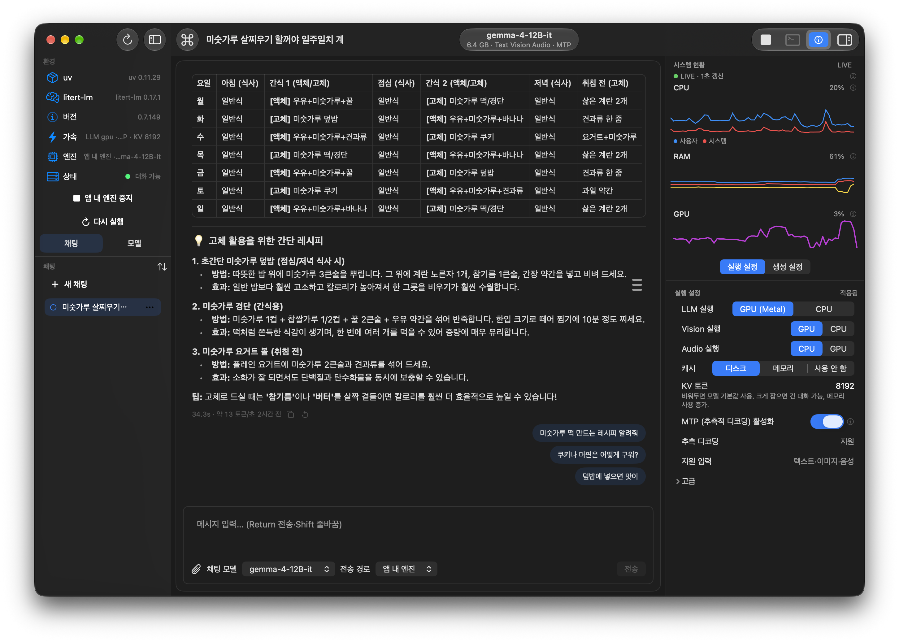
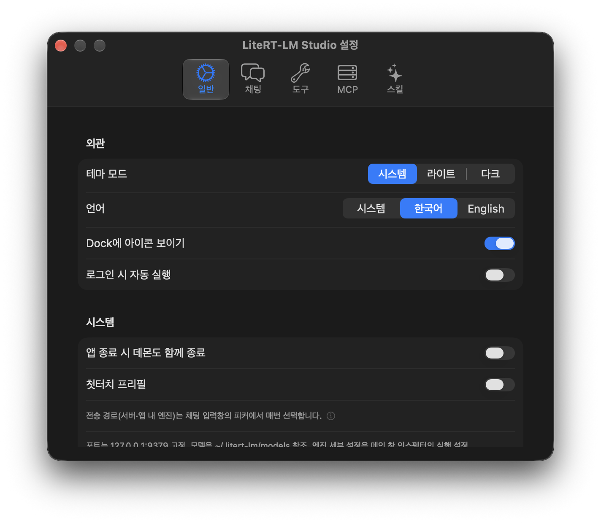
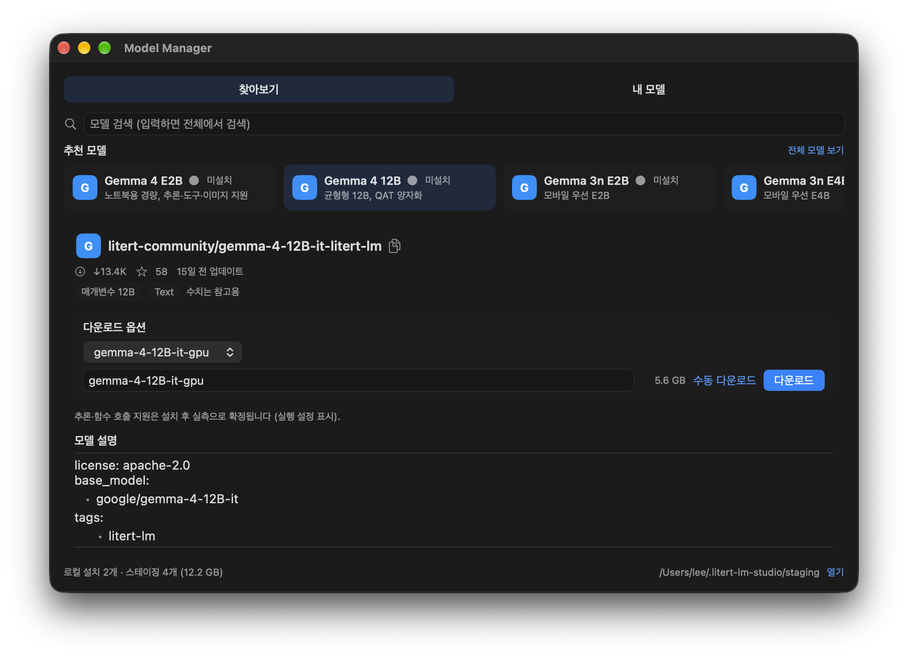
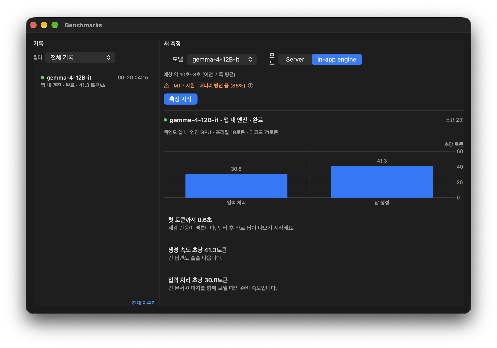

# LiteRT-LM-Studio

[LiteRT-LM](https://github.com/google-ai-edge/LiteRT-LM)용 macOS 네이티브 클라이언트 (SwiftUI) — 도구를 붙인 로컬 채팅, 벤치마크, 모델 관리.

> English version: [README.md](README.md). 전체 사용법은 [docs/사용설명서.md](docs/사용설명서.md) 참고.

## 주요 기능

- **채팅** — 스트리밍 응답, Vision 이미지 첨부, 목차 패널이 있는 대화 목록, 후속 질문 제안, 마크다운 렌더링, 글자 크기 조절, 세션 정렬
- **도구** — 웹 검색(Exa REST), 파일·셸, 시스템 정보, 클립보드 읽기/쓰기, 일정·미리 알림, URL 열기, 단축어. 앱별 권한(**사용 안 함 · 매번 묻기 · 모두 허용**)으로 실행 여부를 정합니다
- **MCP · 스킬** — stdio/SSE MCP 서버 연결, 로컬 스킬 활성화(켜진 스킬 본문이 시스템 프롬프트 앞에 붙음)
- **실행 경로** — 서버 데몬(`litert-lm serve`) 또는 앱 내 엔진(프로세스 내 추론). 채팅 입력창 피커에서 매번 선택
- **모델 관리** — Hugging Face(`litert-community`, `google`) 둘러보기, 진행률 다운로드(일시정지·이어받기), 설치·이름 변경·삭제
- **벤치마크** — 별도 창, 히스토리 보관, AI 결과 분석
- **메뉴바** — 상태 아이템 팝오버에서 엔진 상태·가동 시간·모델 확인, 서버 시작/중지, 최근 채팅방 이동
- **시스템 현황** — CPU/RAM/GPU 미터, 데몬 통계, 디버그 패널
- **한/영 UI** — 설정에서 즉시 전환. 앱이 그리는 문구는 재시작 없이 바뀌고, macOS가 그리는 문구(권한 대화상자)는 다음 실행 때 반영

## 스크린샷

| 채팅 | 설정 > 일반 > 외관 |
| --- | --- |
|  |  일반 > 외관의 언어 항목" width="300"> |
| **모델 관리** | **벤치마크** |
|  |  |

## 요구 사항

- macOS 14 (Sonoma) 이상, Apple Silicon 권장
- [`uv`](https://docs.astral.sh/uv/) (`/opt/homebrew/bin/uv` 경로)
- `litert-lm` CLI — `uv tool install litert-lm`
- 모델 위치: `~/.litert-lm/models`

## 빌드·실행

```sh
./build_and_run.sh build macos     # 빌드 후 ~/Applications에 설치하고 실행
./build_and_run.sh install macos   # 설치만
./build_and_run.sh test macos unit # 단위 테스트 실행
```

`LiteRTLMStudio.xcodeproj`를 Xcode에서 열어 `LiteRTLMStudio` 스킴으로 실행해도 됩니다(macOS 14.0+, Swift 5).

서버는 `127.0.0.1:9379` 고정 포트를 씁니다.

## 설정

설정 창은 다섯 탭으로 나뉩니다.

- **일반** — 테마, Dock 아이콘, 로그인 시 자동 실행, 앱 종료 시 데몬 종료, 첫터치 프리필, 벤치마크 기록 보관, 권한, 언어
- **채팅** — 대화 목차, 후속 질문, 글자 크기, 세션 정렬, 대화 기록 전송
- **도구** — 도구별 토글, 웹 검색(Exa API 키), 작업폴더
- **MCP** — 등록한 MCP 서버
- **스킬** — 설치한 스킬과 프롬프트 예산

앱 문구는 한국어와 영어를 지원합니다. **설정 > 일반 > 외관**에서 언어를 바꾸면 다시 시작하지 않고
바로 적용되고, 권한 대화상자처럼 macOS가 직접 그리는 문구는 다음 실행 때 바뀝니다.

엔진 관련 옵션(백엔드, MTP 등)은 메인 창 **인스펙터 → 실행 설정** 탭에 있습니다.

## 프로젝트 구성

- `LiteRTLMStudio/` — SwiftUI 앱 본체 (`ContentView`, `SidebarView`, `ChatPaneView`, `StatusItemController` 등)
- `LiteRTLMStudio/Core/` — 스토어, 엔진, 다국어, 마크다운, 다운로드 센터
- `LiteRTLMStudioTests/` — 단위 테스트
- `docs/` — PLAN·TODO·DESIGN·CHANGELOG·사용설명서 (한국어)
- `EngineVendor/`, `Vendor/` — 벤더링한 의존성 (엔진 헤더, Highlightr)

## 문서

- [docs/사용설명서.md](docs/사용설명서.md) — 전체 사용 설명서
- [docs/DESIGN.md](docs/DESIGN.md) — 설계 메모
- [docs/CHANGELOG.md](docs/CHANGELOG.md) — 변경 이력(릴리스 노트)
- [docs/CHANGELOG-DETAIL.md](docs/CHANGELOG-DETAIL.md) — 작업 단위 상세 로그

## 라이선스

Apache-2.0 — [LICENSE](LICENSE) 참고. 이 프로젝트는 독립 클라이언트이며 Google과 무관합니다.
